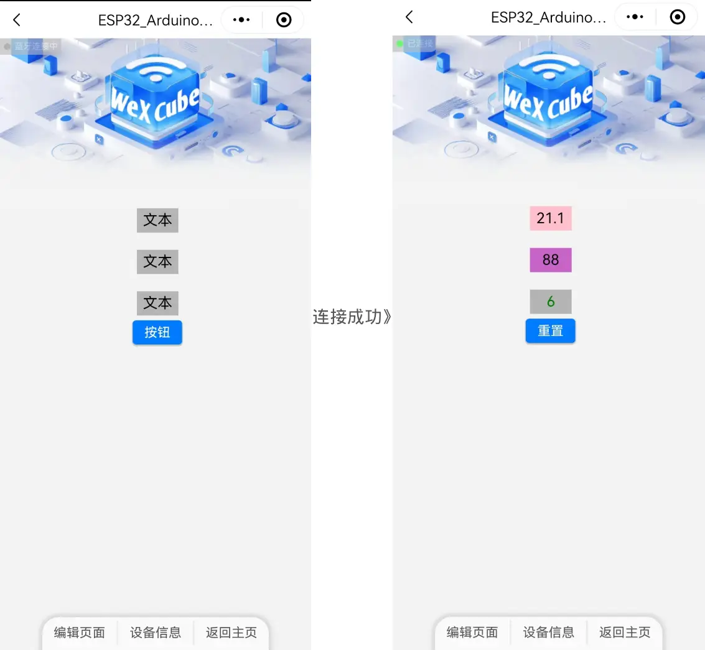

> ### 说明
> ESP32 Arduino 测试有两个示例 
> Test1：适用于 ESP32 BLE 只用于 WeXCube 连接。 
> Test2：适用于 ESP32 BLE 除了有 WeXCube 连接外，用户还定义了其他 BLE 特征服务。 
  
 

> ### 硬件环境
> 编译器：Arduino IDE 2.3.4 
> 单片机：ESP-WROOM-32 
> Arduino开发板框架：ESP32 Dev Module 
  
 

>  
> ### 小程序设备页面
> 3个文本框和1个按钮。文本控件的ID分别为1、2、3，按钮的ID为4。 
> 第一个文本显示ESP32芯片温度，第二个文本显示ESP32芯片内部霍尔传感器值，第三个文本显示计数值，按钮按下后计数值清零。 
