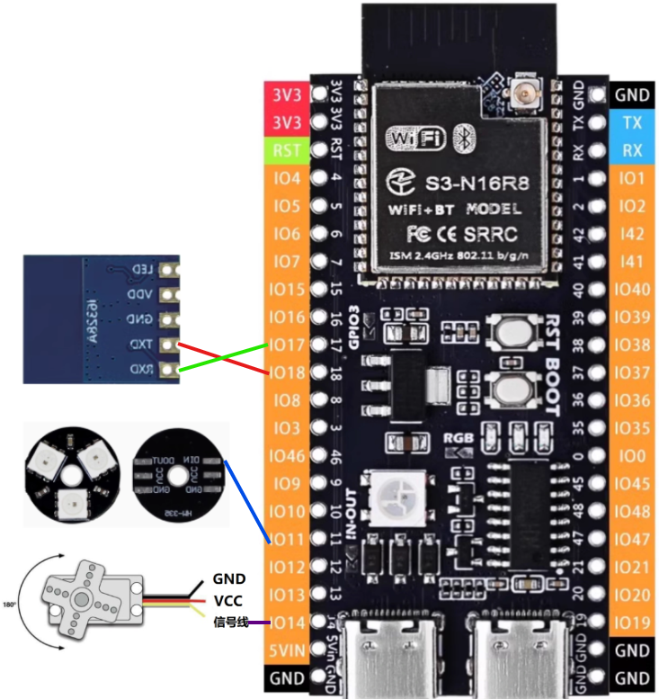
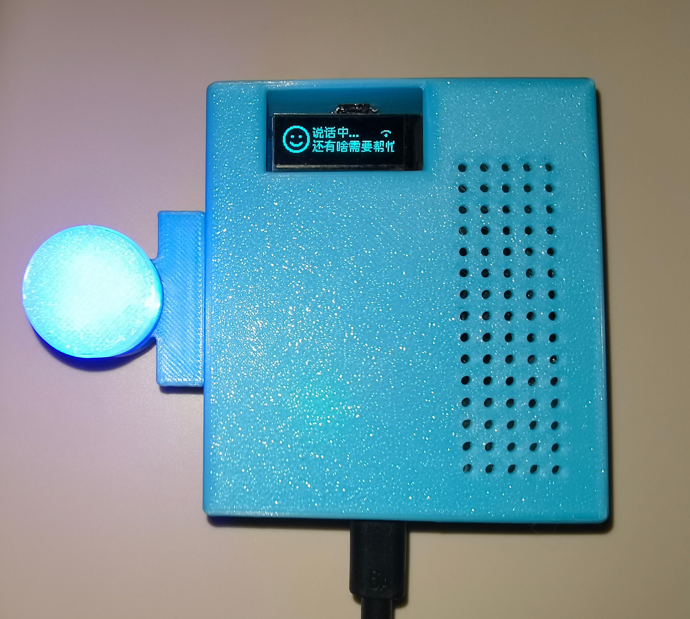
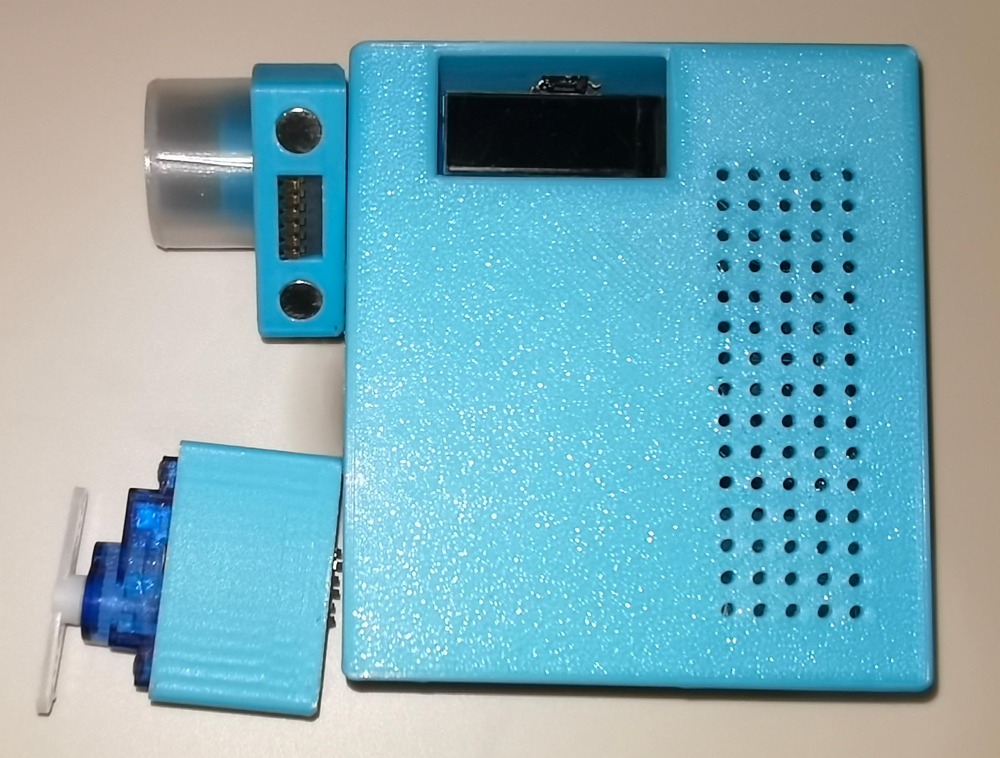
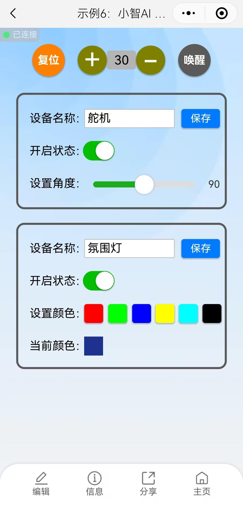

> ## 基本介绍
> 本实例是在小智AI 1.5.5 版本上修改，添加了两个IOT设备：一个舵机（SG90）和一个氛围灯（WS2812）。 
> 代码修改平台VSCode +ESP- IDF。 
> 通过蓝牙透传模块与 WeXCube 小程序通信，在小程序上可以修改IOT设备名称等属性。 

> ## 小智AI控制IOT设备机制
> servo.c、rgb.c分别为舵机与氛围灯类文件，该文件提供了两个接口，一个是AddNumberProperty，用于传递当前设备状态，另一个是AddMethod，用于控制设备状态。
当你询问小智AI设备状态时，他会自动调用相应设备的AddNumberProperty回调函数来获取设备状态。当你让小智AI控制设备时，他会自动调用相应设备的AddMethod回调函数来设置设备状态。 
> 有意思的地方是小智AI不像语音识别设备那样死板，他会理解分析你的话给出恰当的控制。语音控制需要提前设定语音命令，而小智AI不需要，他是基于大模型分析的。 
> 在控制舵机中，我只告诉他需要传递0到180的值就行，他就能理解后续的指令。比如我跟他说让舵机站起来，他就会给舵机发送一个角度值。你甚至还能让它摇摆跳舞。 
> 在氛围灯中，我也只是描述了一下数据格式，他就控制灯光。他能根据要求发生rgb三个字节的数据，比如我要他变成红色，他就会发送0x00FF0000。还能让它闪烁，而我只是做了ws2812的驱动，灯光的变化和颜色我也没有预设。 
> 当然小智AI控制IOT还是有些不足，比如要它控制氛围灯显示黄色，他有时可能会显示错误，在小智AI后台切换不同的大模型效果也不一样。 

> ## 硬件连接示意图
>  

> ## 示例实物图
>  
>  

> ## 本示例小程序控制页面
>  

> ## 小程序控制页面二维码
>  
>