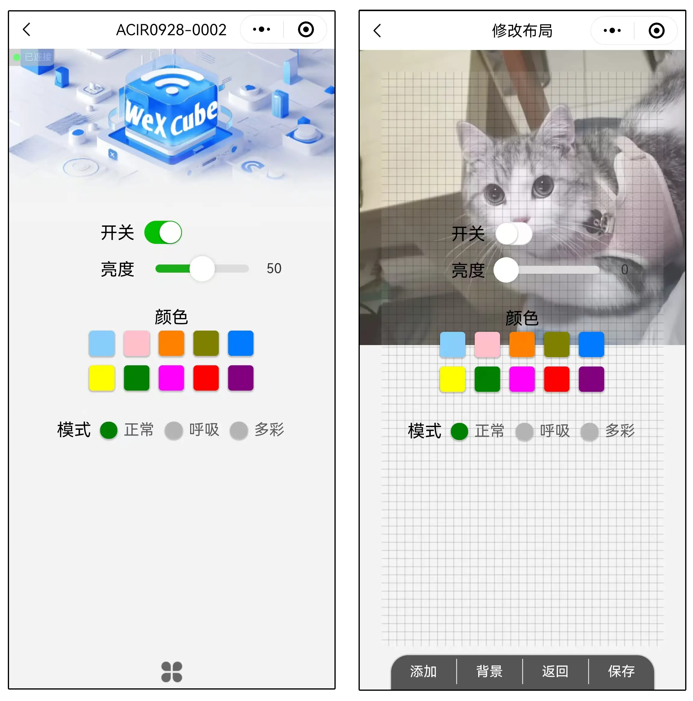

# WeXCube 微信小程序

 

> <b>设备控制页面宽度为 750rpx，控件可以移动区域宽度为 650rpx。</b> 
> <b>设备控制页面除了可以设置控件属性还可以设置页面背景图片。</b>  

> ## 附加功能
> #### 1、创建的设备可以转发分享给他人使用。
> #### 2、分享的设备可以被他人收藏，但页面内容不能修改。
> #### 3、可以在电脑微信上编辑设备内容。

> ## 注意事项
> #### 1、分享的设备如果被删除将关闭分享功能，且不能被恢复。
> #### 2、只有蓝牙和 WeXCube 都连接成功才能进行数据通信。
> #### 3、不能同时在电脑、手机上编辑设备内容。
> #### 4、苹果分享的设备，他人使用需要重新编辑蓝牙连接信息。
> #### 5、删除已经分享的设备会关闭该设备的分享访问。

