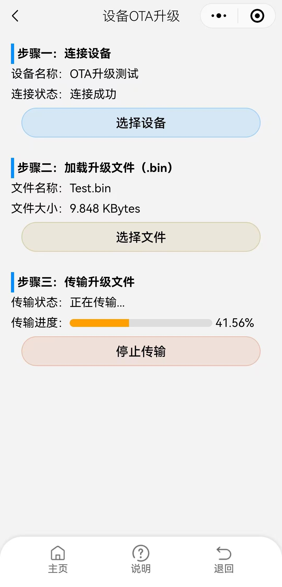
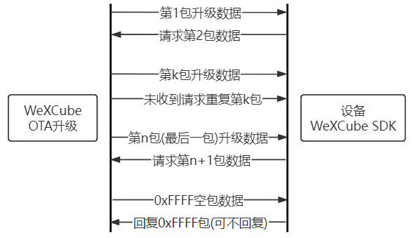
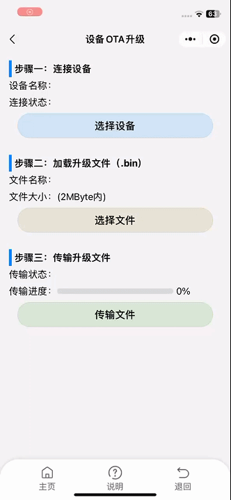

# WeXCube 设备OTA升级

>  

> ### 简要说明
> 1. 升级流程共有三个步骤，只有完成了步骤一和二才能进行步骤三。
> 2. 步骤一只能选择已经创建的设备，设备的蓝牙配置要完整，包含蓝牙ID、通知及写入特征。
> 3. 升级文件后缀必须为.bin且不能超过2M字节，文件内容于二进制形式加载。
> 4. 文件只能选择微信聊天内的，可以将升级文件转发到“文件传输助手”。
> 5. 发送升级数据时，每次发送一包最多64个字节的数据，第一包编号为0，最后一包编号为0xFFFF且数据为空。
> 6. 由于 BLE 传输速率较慢，升级大文件时需要较长时间，请耐心等待。

> ### 升级流程
>  
> 在传输升级数据前，请先选择好需要升级的设备和升级文件。 
> WeXCube小程序会把升级数据划分成若干个数据包，每个数据包都有包号、包长度和数据校验码。 
> 每包的数据长度最大64字节，包号从0开始，升级文件发送完会发送一个包号为0xFFFF的的空包。 
> 包的数据校验码为升级数据的校验和，在SDK内已经完成的校验检查用户无需再次验证。 
> 用户程序每次处理完包数据时应发送下一包请求，如果未及时发送小程序会重复发送上一包数据。 
> <b>升级过程中需保存蓝牙连接通畅，蓝牙断开会导致升级失败。</b>

> ### 程序编写流程
> <b>1. 监听升级指令</b> 
> switch (psWexCmd->eCmdType) 
> { 
>   case eWexCmd_Upgrade:   // 升级指令
>  
> <b>2. 接收升级包数据</b> 
> memcpy(upgradeRecBuff, psWexCmd->sUpgrade.pucPackData, psWexCmd->sUpgrade.ucPackSize); 
> 其中 psWexCmd->sUpgrade.pucPackData 为数据指针，psWexCmd->sUpgrade.ucPackSize 为数据字节数。
>  
> <b>3. 请求下一包数据</b> 
> wex_askUpradePack(psWexCmd->sUpgrade.usPackNo + 1); 
> 其中 psWexCmd->sUpgrade.usPackNo 为当前数据包号。
>  
> <b>4. 把接收到的数据写入到 Flash 中</b> 
> HAL_FLASH_Program(FLASH_TYPEPROGRAM_WORD, beginAdrr, data[i]); 
> 需根据不同单片机自行调整。
>  
> <b>5. 当接收当包号为 0xFFFF 时表明升级数据接收完成可以写入新的固件了。</b>

> ### 推荐升级方式：Bootloader + APP
> <b>1. 正常升级流程</b> 
> APP 监测到升级指令则软件复位单片机，使单片机从 Bootloader 处执行。 
> 在 Bootloader 处接收升级数据并把数据覆盖到 APP 区，接收完成则跳入到 APP 处执行新程序。
>  
> <b>2. APP 异常或无 APP 升级流程</b> 
> 首先给设备断电， 
> 在 WeXCube 小程序升级界面选择好升级文件， 
> 再选择需要升级的设备， 
> 然后给设备上电， 
> 当连接成功立马点击传输文件， 
> Bootloader 中监测升级事件时间越长操作越顺利，建议监测时间大于4秒。

> ### 手机录屏操作
>  