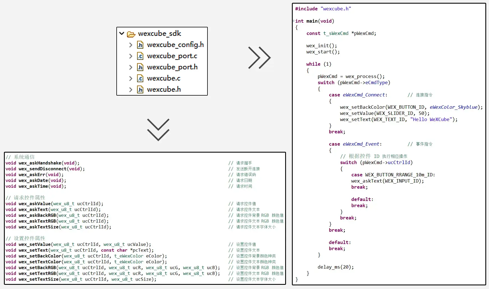

# WeXCube SDK
### module.c 为参考模板，用户可以根据自己的需求修改
>  
> WeXCube SDK 内部有小程序与单片机通信的协议解析功能，用户无需关心通信底层协议实现机制，只需调用相关 SDK 函数。SDK 包由 wexcube_config.h、wexcube_port.c、wexcube_port.h、wexcube.c、wexcube.h 五个文件组成，其中 wexcube 为核心程序，wexcube_config 为配置文件，wexcube_port 为 uart 接口配置文件。使用 SDK 前需要用户完成 wexcube_port 文件中的接口配置。
  
 

> ### 提示
> 请尽量使用最新版SDK。
> 2.x.x 版本 SDK 支持 1.x 版本指令协议。
> 协议pdf文档可在主目录 [Doc](https://gitee.com/jeremywang0102/wexcube/tree/master/Doc) 下找到。
> 以下说明是基于最新版 SDK 介绍的，部分功能在老版 SDK 可能没有，但新版 SDK 可以向下兼容老版。

> ### 通信时间
> 由于WeXCube通信是在BLE蓝牙下实现的，鉴于BLE通信速率较低需要控制好数据发送速度。如果发送数据过快可能会导致WeXCube通信阻塞，提示WeXCube异常断开。为了能顺畅的通信可以适当的加些延时，让数据有足够多的时间发送。
> 时间间隔可以大致认为发送1个字节需要2ms的时间，这样可以避免通信阻塞，如果你使用的BLE通信速率较快可以缩小延时时间。
   
 

> ### wexcube_config 配置
> wexcube_config.h 提供了数据接收和发送缓存大小的配置 
> 如果单片机内发送的指令较少可以减小 WEX_TRS_BUF_SIZE，如果小程序控件较少可以减少 WEX_REC_BUF_SIZE。 
> WEX_TRS_MAX_ONCE 为一次性能发送的最大字节数，值越大发送越快，如果使用的是蓝牙模块可以设置为 128，如果是单片机内置 BLE 建议设置为 20。 

 
  
> ### wexcube_port 配置
> wexcube_port.c 文件中定义了 WeXCube SDK 与单片机通信的接口函数，用户需要根据单片机型号完成接口配置。wexcube_port.h 文件中定义了 WeXCube SDK 与单片机通信的接口函数声明，用户无需修改。 
<b>wex_port_init</b> 函数为接口初始化函数，用户需要根据单片机型号完成接口配置。如果接口在其他地方初始化了，则可以不实现该函数。 
<b>wex_port_send</b> 函数为发送数据函数，用户需要根据单片机型号完成配置。WeXCube SDK 通过该函数往小程序发送数据。 
<b>UART_IRQHandler</b> 函数为接收数据中断函数, 中断函数中调用了 <b>wex_push</b> , 该函数用于把接收的数据推入到 WeXCube SDK 中。如果接收中断在其他地方定义了，则可以不实现此处中断，只需把 <b>wex_push</b> 放入对应中断函数内就行。 
  
 
  
> ### WeXCube SDK 使用
> 将 wexcube_sdk 文件夹下的 wexcube_config.h、wexcube_port.c、wexcube_port.h、wexcube.c、wexcube.h 文件添加到用户工程中，并根据单片机型号完成 wexcube_port 文件中的接口配置。 
> 在项目中只需加入 <b>#include "wexcube.h"</b> 头文件，即可使用 WeXCube SDK 提供的接口函数。 
> 程序中需要调用 <b>wex_init</b>，初始化 WeXCube SDK，及 <b>wex_start</b>, 开启 WeXCube SDK 服务。 
> 程序运行时，通过持续调用 <b>wex_process</b>, 获取 WeXCube SDK 接收到的数据。 
>  
> WeXCube SDK 提供了以下接口函数： 
> <b>页面通信</b> 
> <b>wex_askHandshake(void)</b>  请求握手 
> <b>wex_sendDisconnect(void)</b> 发送断开连接 
> <b>wex_askErr(void)</b> 请求错误码 
> <b>wex_askDate(void)</b> 请求日期 
> <b>wex_askTime(void)</b>  请求时间 
> <b>wex_askDeviceName(void)</b>  请求设备名称 
> <b>wex_askBluetoothId(void)</b>  请求蓝牙 ID 
> <b>wex_showPopup(t_eWexPopupType eType, const char *pcMessage)</b>  显示弹出框 
> 
> <b>请求控件属性</b> 
> <b>wex_askValue(wex_u8_t ucCtrlId)</b> 请求控件值 
> <b>wex_askText(wex_u8_t ucCtrlId)</b> 请求控件文本 
> <b>wex_askBackRGB(wex_u8_t ucCtrlId)</b> 请求控件背景 RGB 颜色值 
> <b>wex_askTextRGB(wex_u8_t ucCtrlId)</b> 请求控件文本 RGB 颜色值 
> <b>wex_askFontSize(wex_u8_t ucCtrlId)</b> 请求控件文本字体大小 
> 
> <b>设置控件属性</b> 
> <b>wex_setValue(wex_u8_t ucCtrlId, wex_u8_t ucValue)</b> 设置控件值 
> <b>wex_setText(wex_u8_t ucCtrlId, const char *pcText)</b> 设置控件文本 
> <b>wex_setBackColor(wex_u8_t ucCtrlId, t_eWexColor eColor)</b> 设置控件背景颜色种类 
> <b>wex_setTextColor(wex_u8_t ucCtrlId, t_eWexColor eColor)</b> 设置控件文本颜色种类 
> <b>wex_setBackRGB(wex_u8_t ucCtrlId, wex_u8_t ucR, wex_u8_t ucG, wex_u8_t ucB)</b> 设置控件背景 RGB 颜色值 
> <b>wex_setTextRGB(wex_u8_t ucCtrlId, wex_u8_t ucR, wex_u8_t ucG, wex_u8_t ucB)</b> 设置控件文本 RGB 颜色值 
> <b>wex_setFontSize(wex_u8_t ucCtrlId, wex_u8_t ucSize)</b> 设置控件文本字体大小 
> <b>wex_sendLineChart(wex_u8_t ucCtrlId, wex_u8_t ucSize, const wex_f32_t* pfArr)</b> 发送折线图显示点（一次最多15个点），点为单精度浮点数且为小端模式 
> <b>wex_clearLineChart(wex_u8_t ucCtrlId)</b> 清空折线图显示 
> 
> <b>数据转换</b> 
> <b>wex_strToInt(const char *pcStr)</b> 将字符串转换为有符号整数 
> <b>wex_strToUint(const char *pcStr)</b> 将字符串转换为无符号整数 
> <b>wex_intToStr(wex_s32_t slInt)</b> 将有符号整数转换为字符串 
> <b>wex_uintToStr(wex_u32_t ulUint)</b> 将无符号整数转换为字符串 
> <b>wex_strToFloat(const char *pcStr)</b> 将字符串转换为单精度浮点数 
> <b>wex_floatToStr(wex_f32_t fFloat, wex_u8_t ucPrecision)</b> 将单精度浮点数转换为字符串 
> <b>wex_strToDouble(const char *pcStr)</b> 将字符串转换为双精度浮点数 
> <b>wex_doubleToStr(wex_f64_t pdDouble, wex_u8_t ucPrecision)</b> 将双精度浮点数转换为字符串 
> 上述 <b>数据转换</b> 中 wex_intToStr、wex_uintToStr、wex_floatToStr、wex_doubleToStr 函数返回的为临时字符串指针，指代的内容随时会被修改，请勿长时间使用，建议只作为 wex_setText 的传递参数使用。 
  
 
  
> ### 控件类型
> WeXCube SDK 支持以下控件类型： 
> <b>button (按钮)</b> 
> <b>switch (开关)</b> 
> <b>text (文本)</b> 
> <b>slider (滑动条)</b> 
> <b>input (输入框)</b> 
> <b>progress (进度条)</b> 
> <b>lineChart (折线图)</b> 
>  
> <b>每个控件都有独一的控件 ID(1-255)，用于标识控件。</b> 
  
 
  
> ### 控件属性
> <b>控件值</b>  控件值用于标识控件状态，如按钮的按下状态。 
> <b>控件文本</b>  控件文本为控件显示的文本内容。 
> <b>控件背景颜色</b>  控件背景颜色为控件背景的显示颜色。 
> <b>控件文本颜色</b>  控件文本颜色为控件文本的显示颜色。 
> <b>控件文本字体大小</b>  控件文本字体大小为控件文本的显示字体大小，字体大小范围 10-255。 
>  
> <b>button (按钮)</b> 具备的属性：控件值(0为抬起，1为按下，2长按)、控件文本、控件背景颜色、控件文本颜色、控件文本字体大小。 
> <b>switch (开关)</b> 具备的属性：控件值(0为关，1为开)。 
> <b>text (文本)</b> 具备的属性：控件文本、控件背景颜色、控件文本颜色、控件文本字体大小。 
> <b>slider (滑动条)</b> 具备的属性：控件值(0-255)。 
> <b>input (输入框)</b> 具备的属性：控件文本(输入的内容)、控件背景颜色、控件文本颜色、控件文本字体大小。 
> <b>progress (进度条)</b> 具备的属性：控件值(0-100)。 
>  
> 控件的属性都可以通过函数读取和设置, 对不存在的属性读取和设置会返回错误码。 
> <b>控件文本如果为中文需要转为utf-8编码格式，否则会乱码。</b> 
  
 
  
> ### 控件事件触发
> 当控件状态发生变化时，小程序会向设备发送控件事件触发指令并携带控件值，这样可以更加及时的知晓控件状态。 
> <b>button (按钮)</b> 按下时发送 1，抬起时发送 0，长按时发送 2（长按功能开启时）。 
> <b>switch (开关)</b> 设置为关发送 0， 设置为开发送 1。 
> <b>slider (滑动条)</b> 值变化时，发送当前数值(0-100)。 
> <b>input (输入框)</b> 输入内容变化时，发送已经输入的内容字符串。如果需要转化为相应数值可以使用 SDK 提供的 <b>数据转换</b> 函数。 
  
 
  
> ### 资源消耗
> <b>ROM</b> 约 2KB，<b>RAM</b> 约 1KB，可以裁剪减小消耗。 
> 通过配置 wexcube_config.h 中的 WEX_REC_BUF_SIZE 及 WEX_TRS_BUF_SIZE 减小 RAM 的消耗。 
> 如果单片机内发送的指令较少可以减小 WEX_TRS_BUF_SIZE，如果小程序控件较少可以减少 WEX_REC_BUF_SIZE。一条指令可以大致认为 10 个字节，根据需求调整 WEX_REC_BUF_SIZE、 WEX_TRS_BUF_SIZE 可以将 RAM 控制在 0.5KB 内。 
> 使用数据转换函数（wex_strToInt、wex_strToUint、wex_intToStr、wex_uintToStr、wex_strToFloat、wex_floatToStr、wex_strToDouble、wex_doubleToStr）将会加大 ROM 的消耗。 
