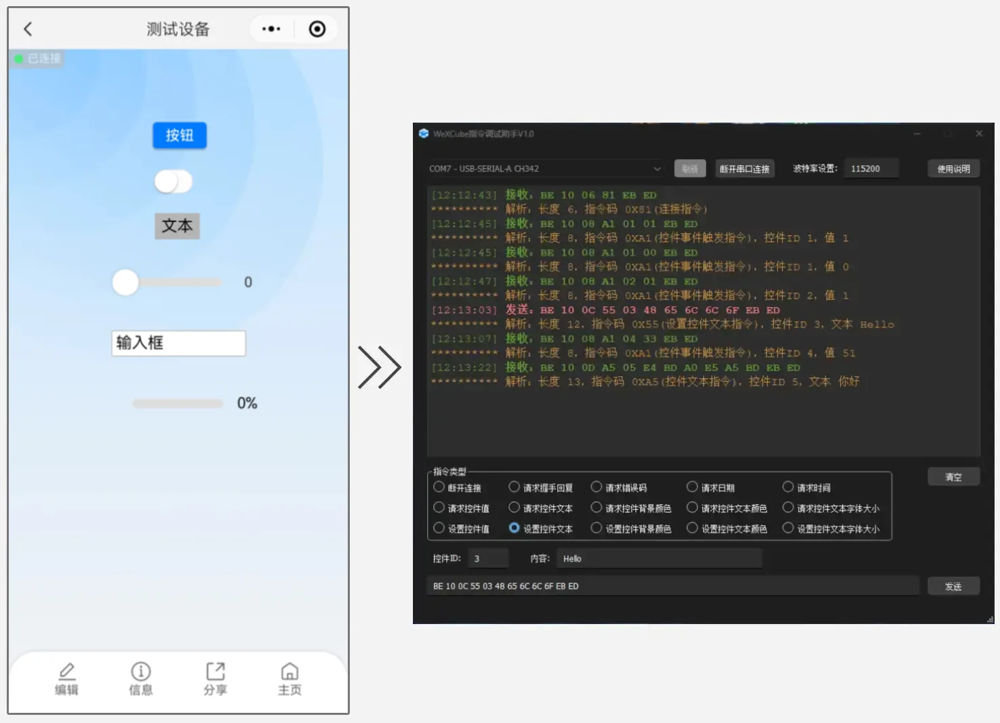

# WeXCube 电脑端指令调试助手

>  
> 电脑端（Windows）指令调试助手可以调试 WeXCube 所有指令，可以使用它快速查看页面使用效果。使用前需要把蓝牙模块接入到 USB 串口助手，然后在调试助手软件上选择正确的串口号，当小程序显示已连接，此时调试助手就可以与小程序通信了。
 
 
 
> ### 指令版本支持
> 1.x 版本指令支持 2.x.x 版本 SDK ，但可能部分指令功能无法使用。 
>  
> <b>推荐使用：</b> 
> 2.0.0 版本 SDK 使用 1.0 版本指令。 
> 2.1.0 版本 SDK 使用 1.1 版本指令。 
